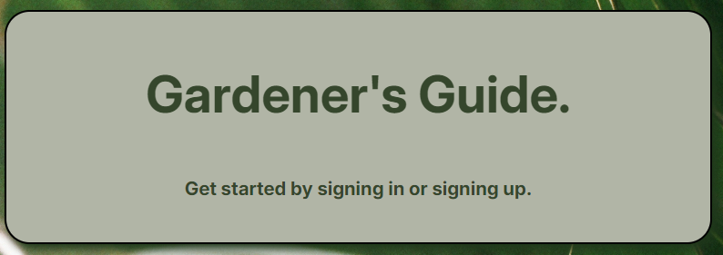

# Gardener's Guide

## What is it?

Gardener's guide is an app for plant minded people to keep track of all the plants they have, whether inside, outside, in their garden, or on their shelves. 

## All the Links 

* [Github - Front End](https://github.com/Baileybk2/gardeners-guide-react)
* [Github - Back End](https://github.com/Baileybk2/gardeners-guide-back-end)
* [Deployed Site](https://gardeners-guide.netlify.app/)
* [Planning Materials](https://trello.com/b/3bVUoEvO/the-gardners-guide-to-caretaking)

## Attributions

[String.prototype.match()](https://developer.mozilla.org/en-US/docs/Web/JavaScript/Reference/Global_Objects/String/match)

[RegExp](https://developer.mozilla.org/en-US/docs/Web/JavaScript/Reference/Global_Objects/RegExp)

[Symbol.match](https://developer.mozilla.org/en-US/docs/Web/JavaScript/Reference/Global_Objects/Symbol/match)

[Use Location](https://reactrouter.com/en/main/hooks/use-location)

[Window Location](https://developer.mozilla.org/en-US/docs/Web/API/Window/location)

## Technologies used

* Github
* Visual Studio Code
* JavaScript
* CSS / SASS
* React
* HTML

## Next Steps

* We would like to implement a calender function to help the user keep track of which plants need to be watered/fertilized, without having to delve deep into the plant's information 